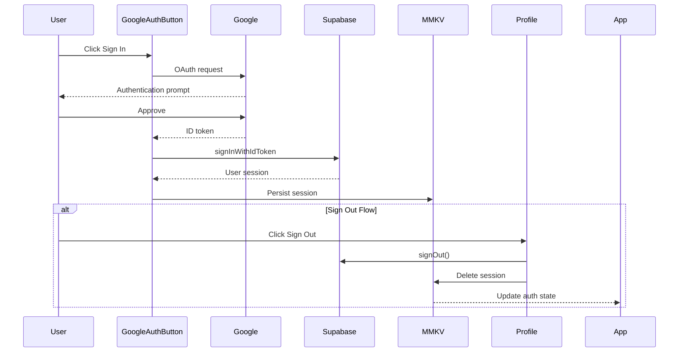
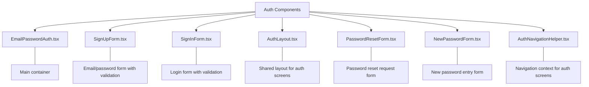
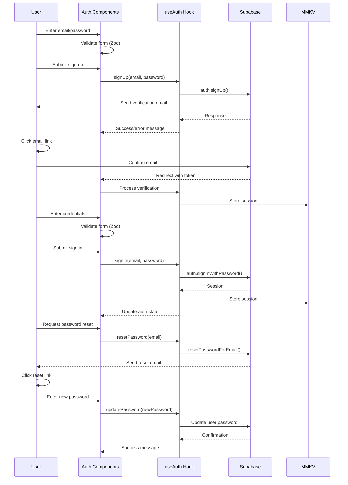
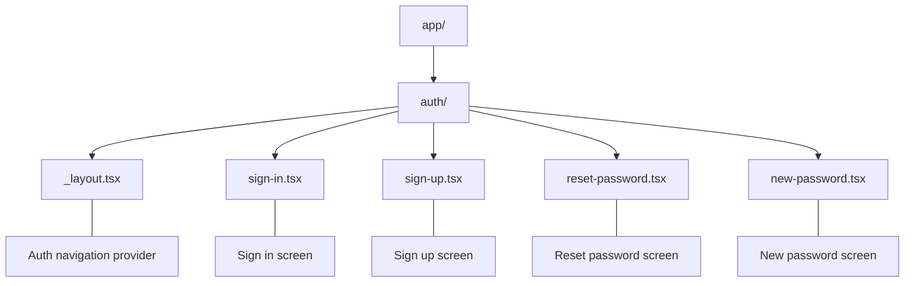

# Authentication Flow

## Overview
Client-side authentication flow interacting with a Supabase backend, handling:
- OAuth integration (Google initially, others planned)
- Email/password signup/login
- Client-side session management using MMKV
- Password recovery UI flow

## Status
**Implementation Progress**: 100% (for required providers)
**Current Phase**: Google OAuth and Email/Password authentication flows are implemented in the client. Integration with additional providers (Microsoft, Apple, Facebook) is currently on hold.

## Authentication Methods Status (Client Integration)
| Method | Client UI | Client Logic (useAuth) | Session Handling (MMKV) | Status | Notes |
|--------|-----------|------------------------|-------------------------|--------|-------|
| Google OAuth | ✅ Complete | ✅ Complete | ✅ Complete | Ready | Relies on Supabase backend config |
| Email/Password | ✅ Complete | ✅ Complete | ✅ Complete | Ready | Relies on Supabase backend config |
| Microsoft OAuth | ❌ Not Started | ❌ Not Started | ❌ Not Started | On Hold | Backend config also needed |
| Apple OAuth | ❌ Not Started | ❌ Not Started | ❌ Not Started | On Hold | Backend config also needed |
| Facebook OAuth | ❌ Not Started | ❌ Not Started | ❌ Not Started | On Hold | Backend config also needed |

## Completed Client Tasks
1. Core Authentication Logic (`hooks/useAuth.ts`)
   - [x] Supabase client initialization (`services/supabase.ts`)
   - [x] Google OAuth flow handling (calling Supabase)
   - [x] Email/Password authentication flow handling (calling Supabase)
   - [x] Password reset flow handling (calling Supabase)
   - [x] Session persistence with MMKV

2. UI Components (`components/auth/`)
   - [x] Google authentication button (`GoogleAuthTest.tsx` - Example)
   - [x] Email/Password sign in form (`SignInForm.tsx`)
   - [x] Email/Password sign up form (`SignUpForm.tsx`)
   - [x] Password reset form (`PasswordResetForm.tsx`)
   - [x] New password form (`NewPasswordForm.tsx`)
   - [x] Sign out functionality (integrated into profile/settings UI)
   - [x] Error handling display for all auth flows
   - [x] Form validation using Zod (`authSchemas.ts`)
   - [x] Password strength indicator component

3. Navigation (`app/auth/`)
   - [x] Auth screens defined using Expo Router
   - [x] Navigation helper/context for auth flows (`AuthNavigationHelper.tsx`)
   - [x] Protected route handling (likely in root `_layout.tsx` checking auth state)

4. Client-Side Security Considerations
   - [x] Secure token handling via Supabase client library
   - [x] Session storage using MMKV (offers encryption)
   - [x] Enforcing password validation requirements in UI forms

## Google OAuth Flow

## Implementation Details

### Authentication Components

### Authentication Flow

### Routing Structure

### Form Validation
All forms implement validation using Zod schemas:
- Email format validation
- Password strength requirements:
  - Minimum 8 characters
  - At least one uppercase letter
  - At least one lowercase letter
  - At least one number
- Password confirmation matching
- Terms acceptance requirement
