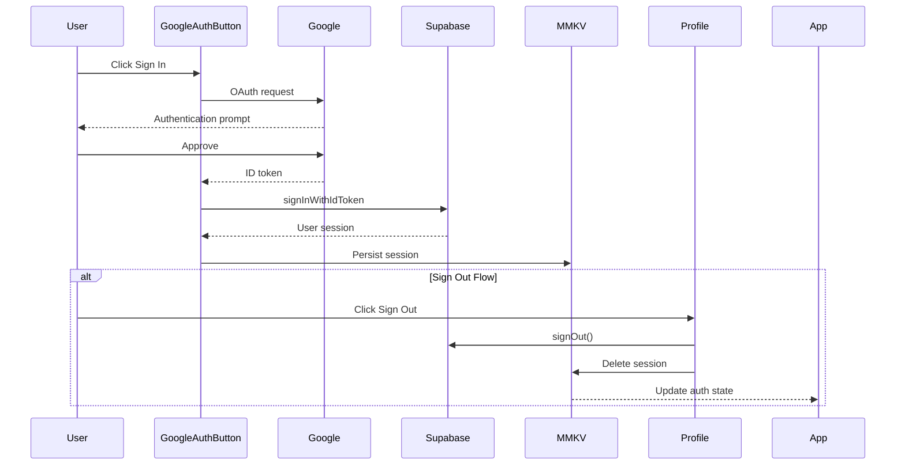
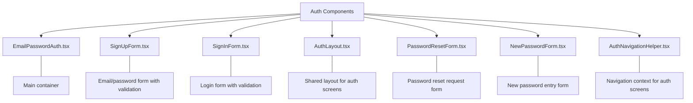
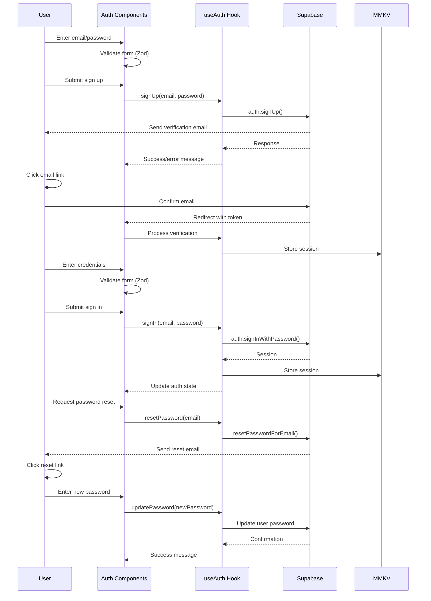
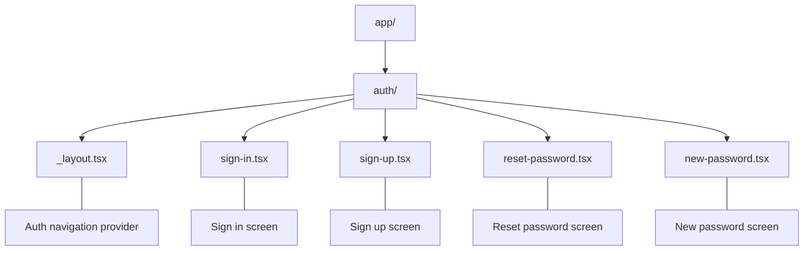

# Authentication Flow

## Overview
Supabase-based authentication system handling:
- OAuth integration (Google, Microsoft, Apple, Facebook)
- Email/password signup/login
- Session management
- Password recovery

## Status
**Implementation Progress**: 100% (for required providers)
**Current Phase**: Google OAuth and Email/Password authentication complete. Additional providers (Microsoft, Apple, Facebook) are currently on hold.

## Authentication Methods Status
| Method | Backend Config | UI Implementation | Session Handling | Status |
|--------|---------------|------------------|-----------------|--------|
| Google OAuth | ✅ Complete | ✅ Complete | ✅ Complete | Production Ready |
| Email/Password | ✅ Complete | ✅ Complete | ✅ Complete | Production Ready |
| Microsoft OAuth | ❌ Not Started | ❌ Not Started | ❌ Not Started | On Hold |
| Apple OAuth | ❌ Not Started | ❌ Not Started | ❌ Not Started | On Hold |
| Facebook OAuth | ❌ Not Started | ❌ Not Started | ❌ Not Started | On Hold |

## Completed Tasks
1. Core Authentication Service
   - [x] Supabase client initialization
   - [x] Google OAuth integration
   - [x] Email/Password authentication
   - [x] Password reset flow
   - [x] Session persistence with MMKV

2. UI Components
   - [x] Google authentication button
   - [x] Email/Password sign in form
   - [x] Email/Password sign up form
   - [x] Password reset form
   - [x] New password form
   - [x] Sign out functionality
   - [x] Error handling for all auth flows
   - [x] Profile data display after authentication
   - [x] Form validation with Zod
   - [x] Password strength indicator

3. Navigation
   - [x] Auth routes in Expo Router
   - [x] Navigation helper for auth flows
   - [x] Protected route handling

4. Security
   - [x] Secure token handling
   - [x] Session storage encryption (MMKV)
   - [x] Password validation requirements

## Google OAuth Flow

## Implementation Details

### Authentication Components

### Authentication Flow

### Routing Structure

### Form Validation
All forms implement validation using Zod schemas:
- Email format validation
- Password strength requirements:
  - Minimum 8 characters
  - At least one uppercase letter
  - At least one lowercase letter
  - At least one number
- Password confirmation matching
- Terms acceptance requirement
