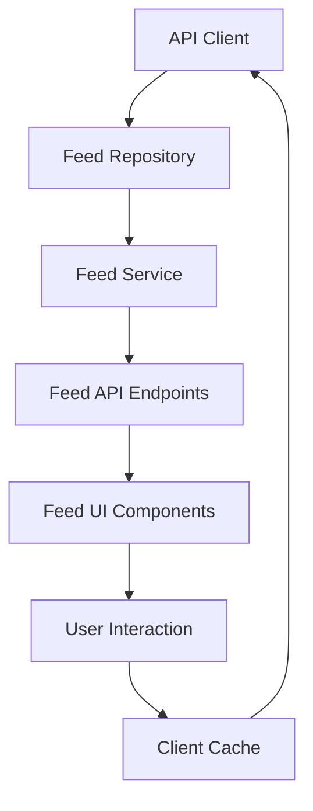
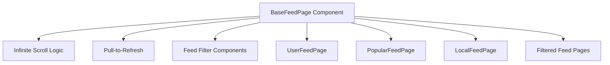

# Feed System

## Overview
The Feed System is a core component of the bikR application, enabling users to discover and interact with content from the motorcycle community. It provides different feed types (User, Popular, Local, Club, Event) with efficient data loading, filtering, and a responsive UI.

## Development Plan Reference
Reference to Phase 2.3 in `developmentPlan.md`:
- Create feed repository interface
- Implement different feed query strategies
- Create feed caching and pagination
- Build feed UI components
- Implement various feed type implementations

## Status
In Progress

## Technical Architecture

### Data Flow


### Component Hierarchy


## Tasks

1. Feed Data Management Layer
   - [x] Define feed repository interface
     - [x] Create FeedQueryOptions interface
     - [x] Create FeedResult interface
     - [x] Define method signatures for different feed types
   - [x] Implement Supabase feed repository
     - [x] Create getUserFeed method
     - [x] Create getPopularFeed method
     - [x] Create getLocalFeed method (with PostGIS integration)
     - [x] Create getFilteredFeed method (for club/event feeds)
     - [x] Debug and fix property name mismatch in cursor generation (`created_at` → `createdAt`)
     - [ ] Create missing database function: `get_popular_feed`
   - [ ] Create feed service layer
     - [ ] Implement business logic for feed item filtering
     - [ ] Add content transformation methods
   - [ ] Implement feed API endpoints
     - [ ] Create GET /feeds/user endpoint
     - [ ] Create GET /feeds/popular endpoint
     - [ ] Create GET /feeds/local endpoint
     - [ ] Create GET /feeds/filtered endpoint
   - [ ] Design and implement caching strategy
     - [ ] Client-side caching with MMKV
     - [ ] API-level caching strategy
     - [ ] Cache invalidation logic

2. Feed UI Components
   - [ ] Create BaseFeedPage component
     - [ ] Implement state management for feed data
     - [ ] Add loading and error states
     - [ ] Build UI layout structure
   - [ ] Implement infinite scroll functionality
     - [ ] Integrate with FlashList for optimal performance
     - [ ] Handle cursor-based pagination
     - [ ] Add scroll position restoration
   - [ ] Create feed filter components
     - [ ] Design filter bar UI
     - [ ] Implement filter state management
     - [ ] Add filter persistence
   - [ ] Add pull-to-refresh functionality
     - [ ] Implement data refresh mechanism
     - [ ] Add loading indicator

3. Feed Type Implementations
   - [ ] Create Feed Context provider
     - [ ] Implement feed state management
     - [ ] Add caching functionality
     - [ ] Create refresh methods
   - [ ] Implement UserFeed page
     - [ ] Create user-specific feed UI
     - [ ] Add followed content logic
   - [ ] Implement PopularFeed page
     - [ ] Add trending content algorithm integration
     - [ ] Create time-sensitive popular content display
   - [ ] Implement LocalFeed page
     - [ ] Add location-based filtering
     - [ ] Create distance indicator component
   - [ ] Implement filtered feed pages
     - [ ] Create ClubFeed page
     - [ ] Create EventFeed page
     - [ ] Add SkillLevelFeed page
     - [ ] Create BikeTypeFeed page

4. Testing
   - [ ] Write repository unit tests
   - [ ] Create service layer tests
   - [ ] Implement UI component tests
   - [ ] Add API endpoint tests
   - [ ] Perform performance testing

## Implementation Details

### Feed Repository Interface
```typescript
// shared/src/repositories/feedRepository.ts
export interface IFeedRepository {
  getUserFeed(userId: string, options: FeedQueryOptions): Promise<FeedResult>;
  getPopularFeed(options: FeedQueryOptions): Promise<FeedResult>;
  getLocalFeed(location: GeoPoint, radius: number, options: FeedQueryOptions): Promise<FeedResult>;
  getFilteredFeed(filterType: string, filterId: string, options: FeedQueryOptions): Promise<FeedResult>;
}

export interface FeedQueryOptions {
  cursor?: string;
  limit?: number;
  contentTypes?: string[];
  dateRange?: DateRange;
  // Additional filter options
}

export interface FeedResult {
  posts: DetailedPost[];
  nextCursor?: string;
  hasMore: boolean;
}
```

### BaseFeedPage Component Structure
```typescript
// bikR/components/feed/BaseFeedPage.tsx
export type FeedPageProps = {
  fetchFeed: (options: FeedQueryOptions) => Promise<FeedResult>;
  onRefresh?: () => Promise<void>;
  filters?: FeedFilter[];
  EmptyComponent?: React.FC;
  HeaderComponent?: React.FC;
};

export function BaseFeedPage({ fetchFeed, onRefresh, filters, ...props }: FeedPageProps) {
  // Implementation details
}
```

### Feed Context Provider
```typescript
// bikR/contexts/FeedContext.tsx
export const FeedContext = createContext<FeedContextType | undefined>(undefined);

export function FeedProvider({ children }: PropsWithChildren<{}>) {
  // Implementation details
}

export const useFeed = () => {
  const context = useContext(FeedContext);
  if (!context) throw new Error("useFeed must be used within a FeedProvider");
  return context;
};
```

## Technical Considerations

1. **Pagination Strategy**:
   - Using cursor-based pagination with post IDs and timestamps
   - Page sizes should be adaptive based on device performance

2. **Performance Optimization**:
   - FlashList for virtualized list rendering
   - Lazy loading and progressive image loading
   - Smart caching to reduce network requests

3. **Offline Support**:
   - MMKV storage for feed data caching
   - Optimistic UI updates
   - Clear loading/error states for network issues

4. **Location Integration**:
   - PostGIS for geospatial queries
   - Privacy considerations for location sharing
   - Battery optimization for location updates

## Integration Points

- **Authentication**: Feed queries need to include user authentication
- **Content Components**: MediaCard is used to render feed items
- **Navigation**: Feed items link to detail pages
- **Storage**: Media content is loaded from Supabase Storage
- **Supabase RLS**: Row Level Security ensures users see only the content they should

## Future Enhancements

- Advanced content recommendation algorithm
- Machine learning for content categorization
- Feed customization options
- Content moderation queue for reported items
- Analytics integration for content performance metrics
