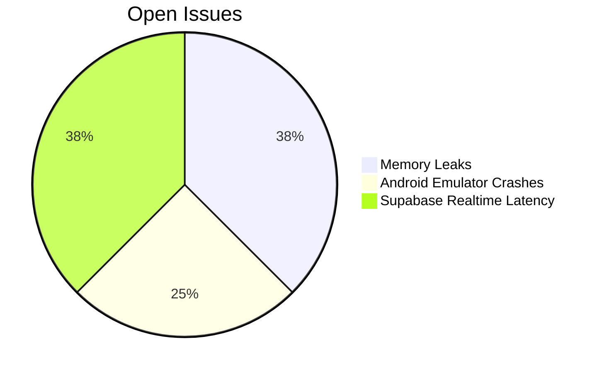

# Development Progress

## Implemented Features
- [x] Expo Router navigation structure
- [x] Tamagui theme system integration
- [x] Google OAuth authentication with Supabase
- [x] Jest testing configuration
- [x] Session persistence with MMKV storage
- [x] Supabase database schema design
- [x] Monorepo structure with shared code

## Current Focus Areas
1. Debugging and Fixing Critical Issues
   - [x] Fix property name mismatch in FeedRepository (100%)
     - [x] Identified mismatch between database field (`created_at`) and application field (`createdAt`)
     - [x] Updated the cursor generation code to use the correct camelCase property name
     - [x] Created mock tests to verify the fix works correctly
   - [ ] Fix TypeScript errors in ContentRepository (0%)
     - [ ] Fix array property access issues (`profiles.id` → `profiles[0].id`)
     - [ ] Update likeCount type handling (array → number)
     - [ ] Resolve contentType/targetType naming inconsistency
     - [ ] Complete PollOption type implementation
   - [ ] Implement missing database functionality (0%)
     - [ ] Create `get_popular_feed` stored procedure
   - [ ] Fix Web Build Configuration (0%)
     - [ ] Resolve persistent Metro errors resolving `react-native-web` and `react-dom/client`.
     - [ ] Investigate potential conflicts with Babel config, Metro config, or patch files.

2. API Layer implementation (100%)
   - [x] Project structure setup (100%)
   - [x] Shared types and validation schemas (100%)
   - [x] Fastify server configuration (100%)
   - [x] Basic API endpoints (100%)
   - [x] Frontend API client service (100%)
   - [x] Fix Swagger plugin configuration error (100%)
   - [x] Fix config access type error (100%)
2. Authentication flow completion (Current providers: 100%)
   - [x] Google OAuth implementation (100%)
   - [x] Email/Password authentication (100%)
   - [ ] Additional OAuth providers (0% - On Hold)
3. Phase 2.1: Content Domain (100%)
   - [x] Define Post domain models (`shared/src/types/post.ts`)
   - [x] Define `IContentRepository` interface (`shared/src/repositories/contentRepository.ts`)
   - [x] Define Zod validation schemas (`shared/src/validation/schemas.ts`)
   - [x] Create initial `ContentService` (`api/src/services/content/contentService.ts`)
   - [x] Implement `POST /posts` endpoint (`api/src/routes/post.ts`)
   - [x] Implement `SupabaseContentRepository` (API - `createPost` method) (`api/src/repositories/supabaseContentRepository.ts`)
   - [x] Refactor `ContentService` to use Repository (API - `createPost` method)
   - [x] Define `DetailedPost` type (`shared/src/types/post.ts`)
   - [x] Create `func_get_detailed_post` RPC function (`memory-bank/schema/rpc/func_get_detailed_post.sql`)
   - [x] Implement `getPostById` in `SupabaseContentRepository` (API)
   - [x] Implement `getPostById` in `ContentService` (API)
   - [x] Implement `GET /posts/:postId` endpoint (`api/src/routes/post.ts`)
   - [x] Implement `updatePost` in `SupabaseContentRepository` (API)
   - [x] Implement `updatePost` in `ContentService` (API)
   - [x] Implement `PUT /posts/:postId` endpoint (`api/src/routes/post.ts`)
   - [x] Implement `deletePost` in `SupabaseContentRepository` (API)
   - [x] Implement `deletePost` in `ContentService` (API)
   - [x] Implement `DELETE /posts/:postId` endpoint (`api/src/routes/post.ts`)
   - [x] Add `updatePostSchema` for validating post updates (`shared/src/validation/schemas.ts`)
   - [x] Implement Content Storage logic (Media Linking in Repo) (API)
   - [ ] Implement Comment Repository methods (API)
   - [ ] Implement Comment Service methods (API)
   - [ ] Implement Comment endpoints (`api/src/routes/post.ts`)
   - [x] Implement Like Repository methods (API) 
   - [x] Implement Like Service methods (API)
   - [x] Implement Like endpoints (`api/src/routes/post.ts`)
   - [ ] Implement Bookmark Repository methods (API)
   - [ ] Implement Bookmark Service methods (API)
   - [ ] Implement Bookmark endpoints (`api/src/routes/post.ts`)
   - [x] Implement Content Storage logic (Media Linking in Repo) (API)
   - [ ] Implement Content Storage logic (Media Validation in Service - TBD) (API)
4. Phase 2.2: MediaCard Component System (100%)
   - [x] Core MediaCard Components
     - [x] Create base MediaCard component (`bikR/components/content/MediaCard/MediaCard.tsx`)
     - [x] Implement text post rendering (`bikR/components/content/MediaCard/TextPostCard.tsx`)
     - [x] Implement image gallery component (`bikR/components/content/MediaCard/ImageGalleryCard.tsx`)
     - [x] Implement video player component (`bikR/components/content/MediaCard/VideoPlayerCard.tsx`)
     - [x] Create context badge components (`bikR/components/content/MediaCard/ContextBadge.tsx`)
     - [x] Implement poll card component (`bikR/components/content/MediaCard/PollCard.tsx`)
   - [x] Engagement Components
     - [x] Create engagement ribbon component (`bikR/components/content/EngagementRibbon/EngagementRibbon.tsx`)
     - [x] Implement like/dislike functionality (`bikR/components/content/EngagementRibbon/LikeButton.tsx`)
     - [x] Create comment count indicator (`bikR/components/content/EngagementRibbon/CommentButton.tsx`)
     - [x] Implement share functionality (`bikR/components/content/EngagementRibbon/ShareButton.tsx`)
     - [x] Create bookmarking system (`bikR/components/content/EngagementRibbon/BookmarkButton.tsx`)
     - [x] Implement event-specific actions (`bikR/components/content/EngagementRibbon/EventActions.tsx`)
   - [x] Owner Ribbon Components
     - [x] Create owner information display (`bikR/components/content/OwnerRibbon/OwnerRibbon.tsx`)
     - [x] Implement user information display (`bikR/components/content/OwnerRibbon/UserInfo.tsx`) 
     - [x] Implement timestamp formatting (`bikR/components/content/OwnerRibbon/PostMetadata.tsx`)
     - [x] Create user quick-action buttons (`bikR/components/content/OwnerRibbon/UserActions.tsx`)
     - [x] Implement rider status indicator (`bikR/components/content/OwnerRibbon/RiderStatus.tsx`)
   - [x] Support and Integration
     - [x] Add TypeScript interfaces (`bikR/components/content/MediaCard/MediaCardTypes.ts`)
     - [x] Create component exports (`bikR/components/content/MediaCard/index.tsx`)
     - [x] Add test structure (`bikR/components/content/__tests__/MediaCard.test.tsx`)
     - [x] Create examples (`bikR/components/content/examples/MediaCardExamples.tsx`)
     - [x] Implement feed example (`bikR/components/content/examples/FeedExample.tsx`)
5. Phase 2.3: Feed System (100%)
   - [x] Feed Data Management Layer
     - [x] Define feed repository interface
     - [x] Create feed types and schemas
     - [x] Implement Supabase feed repository
     - [x] Create feed service layer
     - [x] Implement feed API endpoints
     - [x] Design caching strategy
   - [x] Feed UI Components
     - [x] Create BaseFeedPage component
     - [x] Implement infinite scroll functionality
     - [x] Create feed filter components
     - [x] Add pull-to-refresh functionality
   - [x] API Integration
     - [x] Add feed methods to API client
     - [x] Implement feed route handlers
     - [x] Define API response types
   - [x] Feed Types Implementation
     - [x] Create UserFeed implementation
     - [x] Create PopularFeed implementation
     - [x] Create LocalFeed implementation
     - [x] Create filtered feed implementations
6. Database schema implementation (100%)
   - [x] Core User Management tables (100%)
   - [x] Content Management tables (100%)
   - [x] Social Interaction tables (100%)
   - [x] Club Management tables (100%)
   - [x] Event Management tables (100%)
   - [x] Location Services tables (100%)
   - [x] Communication tables (100%)
   - [x] Marketplace tables (100%)
   - [x] Achievement & Gamification tables (100%)
   - [x] Ride Companion tables (100%)
   - [x] Safety & Emergency tables (100%)
   - [x] Notification System tables (100%)

## Next Steps
- Begin Phase 3: Social Interaction Features
  - Start with Comment System implementation
    - Complete Comment Repository methods in Content Repository
    - Implement Comment Service methods
    - Create Comment endpoints
    - Build Comment UI components
  - Develop Follow/Connection system 
    - Design social graph models
    - Implement follow/unfollow functionality
    - Create user discovery features
  - Implement Content Sharing features
    - Design share service for internal and external sharing
    - Build share UI components
- Complete remaining Content Domain tasks from Phase 2.1
  - Finish implementing Like functionality
  - Implement Bookmark functionality
  - Complete Content Storage with media validation

## Known Issues

## Pending Integrations
- Map SDK selection
- Payment gateway implementation
- Offline sync mechanism
