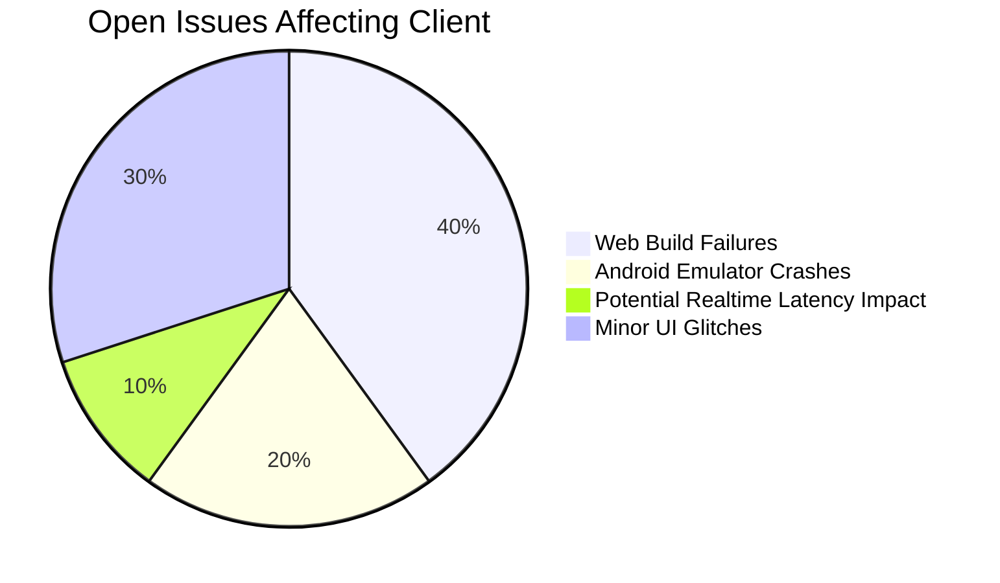

# Client Development Progress

## Implemented Features
- [x] Expo Router navigation structure (`bikr-client/app`)
- [x] Tamagui theme system integration (`bikr-client/constants`, `bikr-client/components/Themed*`)
- [x] Google OAuth authentication integration (client-side flow, API interaction)
- [x] Jest testing configuration (`bikr-client/components/__tests__`)
- [x] Session persistence with MMKV storage (`bikr-client/hooks/useAuth.ts`)
- [x] Usage of shared types/schemas from `bikr-shared`
- [x] Phase 1 Profile & Onboarding Features (Repository, Screens, Tamagui Refactor)
- [x] Phase 3.2: Following & Connections (Initial Implementation - Repositories, Search, Lists, Profile Links)

## Current Focus Areas
1. Debugging and Fixing Critical Issues
   - [x] Fix feed loading issues related to data processing/caching (100%)
   - [ ] Fix remaining TypeScript errors during API integration (e.g., type mismatches) (20%)
   - [ ] Fix Web Build Configuration (0%)
     - [ ] Resolve persistent Metro errors resolving `react-native-web` and `react-dom/client`.
     - [ ] Investigate potential conflicts with Babel config, Metro config, or patch files.

2. Authentication flow completion (Current providers: 100%)
   - [x] Google OAuth integration (100%)
   - [x] Email/Password authentication integration (UI + API calls) (100%)
   - [ ] Additional OAuth providers (0% - On Hold)
3. Phase 2.1: Content Domain API Integration (Client-Side) (90%)
   - [x] Utilize Post domain models from `bikr-shared`
   - [x] Utilize Zod validation schemas from `bikr-shared`
   - [x] Define `IContentRepository` interface (`bikr-client/repositories/IContentRepository.ts`)
   - [x] Implement `SupabaseContentRepository` (`bikr-client/repositories/SupabaseContentRepository.ts`)
   - [x] Implement Content Creation Screen (`bikr-client/app/(tabs)/create.tsx`)
   - [x] Integrate `expo-image-picker` for media selection in creation screen
   - [x] Integrate `SupabaseContentRepository` into creation screen (`handleSubmit`)
   - [x] Integrate with `POST /posts` endpoint (via Repository)
   - [x] Integrate with `GET /posts/:postId` endpoint (via Repository)
    - [x] Integrate with `PUT /posts/:postId` endpoint (via Repository)
    - [x] Integrate with `DELETE /posts/:postId` endpoint (via Repository)
    - [x] Integrate with Like endpoints (`POST`, `DELETE`, `GET /posts/:postId/like`) (UI + API calls)
    - [x] Integrate with Comment endpoints (API calls) (100%)
    - [ ] Integrate with Bookmark endpoints (API calls) (0%)
    - [x] Implement media upload logic (client-side to storage/API via Repository)
 4. Phase 2.2: MediaCard Component System (Client-Side) (100%)
   - [x] Core MediaCard Components
     - [x] Create base MediaCard component (`bikr-client/components/content/MediaCard/MediaCard.tsx`)
     - [x] Implement text post rendering (`bikr-client/components/content/MediaCard/TextPostCard.tsx`)
     - [x] Implement image gallery component (`bikr-client/components/content/MediaCard/ImageGalleryCard.tsx`)
     - [x] Implement video player component (`bikr-client/components/content/MediaCard/VideoPlayerCard.tsx`)
     - [x] Create context badge components (`bikr-client/components/content/MediaCard/ContextBadge.tsx`)
     - [x] Implement poll card component (`bikr-client/components/content/MediaCard/PollCard.tsx`)
   - [x] Engagement Components
     - [x] Create engagement ribbon component (`bikr-client/components/content/EngagementRibbon/EngagementRibbon.tsx`)
     - [x] Implement like/dislike functionality (`bikr-client/components/content/EngagementRibbon/LikeButton.tsx`)
     - [x] Create comment count indicator (`bikr-client/components/content/EngagementRibbon/CommentButton.tsx`)
     - [x] Implement share functionality (`bikr-client/components/content/EngagementRibbon/ShareButton.tsx`)
     - [x] Create bookmarking system (`bikr-client/components/content/EngagementRibbon/BookmarkButton.tsx`)
     - [x] Implement event-specific actions (`bikr-client/components/content/EngagementRibbon/EventActions.tsx`)
   - [x] Owner Ribbon Components
     - [x] Create owner information display (`bikr-client/components/content/OwnerRibbon/OwnerRibbon.tsx`)
     - [x] Implement user information display (`bikr-client/components/content/OwnerRibbon/UserInfo.tsx`) 
     - [x] Implement timestamp formatting (`bikr-client/components/content/OwnerRibbon/PostMetadata.tsx`)
     - [x] Create user quick-action buttons (`bikr-client/components/content/OwnerRibbon/UserActions.tsx`)
     - [x] Implement rider status indicator (`bikr-client/components/content/OwnerRibbon/RiderStatus.tsx`)
   - [x] Support and Integration
     - [x] Add TypeScript interfaces (`bikr-client/components/content/MediaCard/MediaCardTypes.ts`)
     - [x] Create component exports (`bikr-client/components/content/MediaCard/index.tsx`)
     - [x] Add test structure (`bikr-client/components/content/__tests__/MediaCard.test.tsx`)
     - [x] Create examples (`bikr-client/components/content/examples/MediaCardExamples.tsx`)
      - [x] Implement feed example (`bikr-client/components/content/examples/FeedExample.tsx`)
 5. Phase 2.3: Feed System (Client-Side) (95%)
    - [x] Feed Data Management Layer (Client)
 6. Phase 3.1: Comment System (Client-Side) (100%)
    - [x] Implement Comment UI Components (`CommentInput`, `CommentItem`, `CommentList`)
    - [x] Integrate Comment UI with Repository/API (Create, Read, Update, Delete, Like/Unlike)
    - [x] Integrate Comment Count display in `EngagementRibbon`
    - [x] Integrate Comment display toggle in `MediaCard`
     - [x] Define client-side feed repository interface (`bikr-client/repositories/IFeedRepository.ts`)
     - [x] Implement client-side feed repository (`bikr-client/repositories/SupabaseFeedRepository.ts`)
     - [x] Integrate `SupabaseFeedRepository` into `FeedContext` (`bikr-client/contexts/FeedContext.tsx`)
     - [x] Utilize feed types from `bikr-shared`
     - [x] Implement client-side caching strategy (`bikr-client/utils/feedCache.ts`)
     - [x] Install `expo-location` dependency for local feed
   - [x] Feed UI Components
     - [x] Create BaseFeedPage component (`bikr-client/components/feed/BaseFeedPage.tsx`)
     - [x] Implement infinite scroll functionality
     - [x] Create feed filter components
     - [x] Add pull-to-refresh functionality
   - [x] API Integration
     - [x] Integrate Feed Repository into `FeedContext`
     - [x] Implement feed screen logic (`bikr-client/app/(tabs)/index.tsx`, etc.)
   - [x] Feed Types Implementation (Client UI)
     - [x] Create UserFeed implementation
     - [x] Create PopularFeed implementation
     - [x] Create LocalFeed implementation
     - [ ] Create filtered feed implementations (UI integration pending)

7. Phase 4: Club Management (Client-Side) (75% - In Progress)
   - [x] Shared Definitions (`@bikr/shared`) updated (Types, Schemas including pagination/errors, Interface) - *Needs publishing*
   - [x] Server API implementation complete (Repository, Service, Routes, Auth).
     - [ ] **Pending Server Tasks:** Testing, Swagger Docs.
   - [x] Client Repository (`SupabaseClubRepository`) implementation completed
     - [x] All API methods implemented and tested
     - [x] Context provider for club data access added
   - [x] UI Components developed
     - [x] `ClubListItem.tsx` component implemented
     - [x] `JoinLeaveButton.tsx` component implemented
     - [x] `ClubHeader.tsx` component implemented
     - [x] `ClubMemberListItem.tsx` component implemented
     - [x] Club components index file created
     - [ ] `ClubSettingsForm.tsx` still needed
   - [x] Core Screens implemented
     - [x] Club discovery page (`app/club/index.tsx`)
     - [x] Club profile layout (`app/club/[clubId]/_layout.tsx`)
     - [x] Club feed screen (`app/club/[clubId]/index.tsx`)
     - [x] Club details screen (`app/club/[clubId]/details.tsx`)
     - [x] Club members screen (`app/club/[clubId]/members.tsx`)
     - [ ] Club creation screen still needed
     - [ ] Club settings screen still needed
   - [ ] Integration into navigation and user profiles needed

 ## Next Steps (Client Focus)
 - Complete Phase 4: Club Management (Client-Side)
   - Implement `ClubSettingsForm.tsx` component
   - Implement club creation screen (`app/club/create.tsx`)
   - Implement club settings screen for admins (`app/club/[clubId]/settings.tsx`)
   - Add "Clubs" item to main navigation
   - Integrate club memberships into user profiles
 - Refine Phase 3.2: Following & Connections
   - Address TODOs (initial follow status, pagination, TS errors).
 - Implement Phase 3.3: Content Sharing features (Client-Side)
    - Build share UI components/interactions
    - Integrate with native sharing APIs
 - Complete remaining Content Domain API integrations (Bookmarks)

## Known Issues (Client Impact)

## Pending Integrations (Client-Side)
- Map SDK selection and integration
- Payment gateway SDK/UI integration
- Offline sync mechanism implementation
