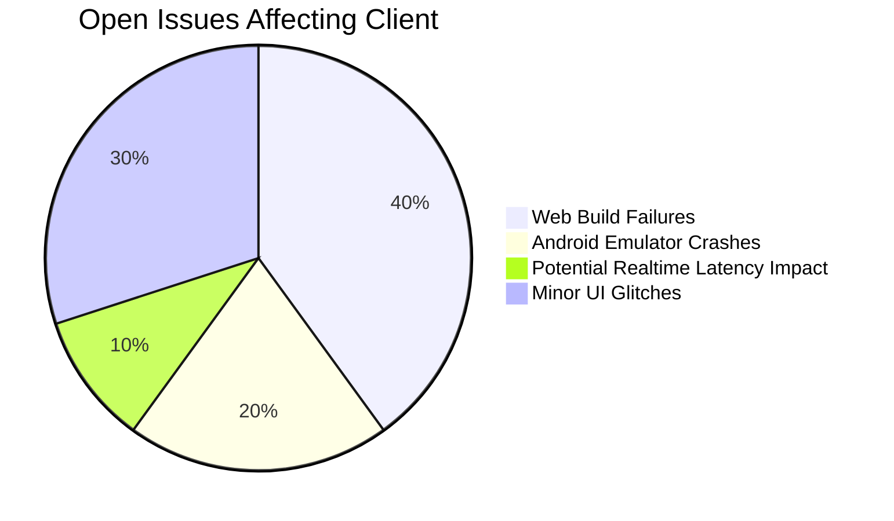

# Client Development Progress

## Implemented Features
- [x] Expo Router navigation structure (`bikr-client/app`)
- [x] Tamagui theme system integration (`bikr-client/constants`, `bikr-client/components/Themed*`)
- [x] Google OAuth authentication integration (client-side flow, API interaction)
- [x] Jest testing configuration (`bikr-client/components/__tests__`)
- [x] Session persistence with MMKV storage (`bikr-client/hooks/useAuth.ts`)
- [x] Usage of shared types/schemas from `bikr-shared`

## Current Focus Areas
1. Debugging and Fixing Critical Issues
   - [x] Fix feed loading issues related to data processing/caching (100%)
   - [ ] Fix remaining TypeScript errors during API integration (e.g., type mismatches) (20%)
   - [ ] Fix Web Build Configuration (0%)
     - [ ] Resolve persistent Metro errors resolving `react-native-web` and `react-dom/client`.
     - [ ] Investigate potential conflicts with Babel config, Metro config, or patch files.

2. Authentication flow completion (Current providers: 100%)
   - [x] Google OAuth integration (100%)
   - [x] Email/Password authentication integration (UI + API calls) (100%)
   - [ ] Additional OAuth providers (0% - On Hold)
3. Phase 2.1: Content Domain API Integration (Client-Side) (80%)
   - [x] Utilize Post domain models from `bikr-shared`
   - [x] Utilize Zod validation schemas from `bikr-shared`
   - [x] Integrate with `POST /posts` endpoint (UI + API call)
   - [x] Integrate with `GET /posts/:postId` endpoint (API call)
   - [x] Integrate with `PUT /posts/:postId` endpoint (UI + API call)
   - [x] Integrate with `DELETE /posts/:postId` endpoint (API call)
   - [x] Integrate with Like endpoints (`POST`, `DELETE`, `GET /posts/:postId/like`) (UI + API calls)
   - [ ] Integrate with Comment endpoints (API calls) (0%)
   - [ ] Integrate with Bookmark endpoints (API calls) (0%)
   - [x] Implement media upload logic (client-side to storage/API)
4. Phase 2.2: MediaCard Component System (Client-Side) (100%)
   - [x] Core MediaCard Components
     - [x] Create base MediaCard component (`bikr-client/components/content/MediaCard/MediaCard.tsx`)
     - [x] Implement text post rendering (`bikr-client/components/content/MediaCard/TextPostCard.tsx`)
     - [x] Implement image gallery component (`bikr-client/components/content/MediaCard/ImageGalleryCard.tsx`)
     - [x] Implement video player component (`bikr-client/components/content/MediaCard/VideoPlayerCard.tsx`)
     - [x] Create context badge components (`bikr-client/components/content/MediaCard/ContextBadge.tsx`)
     - [x] Implement poll card component (`bikr-client/components/content/MediaCard/PollCard.tsx`)
   - [x] Engagement Components
     - [x] Create engagement ribbon component (`bikr-client/components/content/EngagementRibbon/EngagementRibbon.tsx`)
     - [x] Implement like/dislike functionality (`bikr-client/components/content/EngagementRibbon/LikeButton.tsx`)
     - [x] Create comment count indicator (`bikr-client/components/content/EngagementRibbon/CommentButton.tsx`)
     - [x] Implement share functionality (`bikr-client/components/content/EngagementRibbon/ShareButton.tsx`)
     - [x] Create bookmarking system (`bikr-client/components/content/EngagementRibbon/BookmarkButton.tsx`)
     - [x] Implement event-specific actions (`bikr-client/components/content/EngagementRibbon/EventActions.tsx`)
   - [x] Owner Ribbon Components
     - [x] Create owner information display (`bikr-client/components/content/OwnerRibbon/OwnerRibbon.tsx`)
     - [x] Implement user information display (`bikr-client/components/content/OwnerRibbon/UserInfo.tsx`) 
     - [x] Implement timestamp formatting (`bikr-client/components/content/OwnerRibbon/PostMetadata.tsx`)
     - [x] Create user quick-action buttons (`bikr-client/components/content/OwnerRibbon/UserActions.tsx`)
     - [x] Implement rider status indicator (`bikr-client/components/content/OwnerRibbon/RiderStatus.tsx`)
   - [x] Support and Integration
     - [x] Add TypeScript interfaces (`bikr-client/components/content/MediaCard/MediaCardTypes.ts`)
     - [x] Create component exports (`bikr-client/components/content/MediaCard/index.tsx`)
     - [x] Add test structure (`bikr-client/components/content/__tests__/MediaCard.test.tsx`)
     - [x] Create examples (`bikr-client/components/content/examples/MediaCardExamples.tsx`)
     - [x] Implement feed example (`bikr-client/components/content/examples/FeedExample.tsx`)
5. Phase 2.3: Feed System (Client-Side) (90%)
   - [x] Feed Data Management Layer (Client)
     - [x] Define client-side feed repository interface
     - [x] Utilize feed types from `bikr-shared`
     - [x] Implement client-side feed repository methods (calling API)
     - [x] Implement client-side caching strategy (`bikr-client/utils/feedCache.ts`)
   - [x] Feed UI Components
     - [x] Create BaseFeedPage component (`bikr-client/components/feed/BaseFeedPage.tsx`)
     - [x] Implement infinite scroll functionality
     - [x] Create feed filter components
     - [x] Add pull-to-refresh functionality
   - [x] API Integration
     - [x] Add feed methods to API client (`bikr-client/services/api.ts`)
     - [x] Implement feed screen logic (`bikr-client/app/(tabs)/index.tsx`, etc.)
   - [x] Feed Types Implementation (Client UI)
     - [x] Create UserFeed implementation
     - [x] Create PopularFeed implementation
     - [x] Create LocalFeed implementation
     - [ ] Create filtered feed implementations (UI integration pending)

## Next Steps (Client Focus)
- Begin Phase 3: Social Interaction Features (Client-Side)
  - Start with Comment System implementation
    - Build Comment UI components (`bikr-client/components/content/Comment/`)
    - Integrate Comment UI with API endpoints (Create, Read, Update, Delete, Like)
  - Develop Follow/Connection system (Client-Side)
    - Implement UI for user discovery (search, recommendations)
    - Implement UI for following/followers lists
    - Integrate follow/unfollow actions with API
  - Implement Content Sharing features (Client-Side)
    - Build share UI components/interactions
    - Integrate with native sharing APIs
- Complete remaining Content Domain API integrations (Comments, Bookmarks)

## Known Issues (Client Impact)

## Pending Integrations (Client-Side)
- Map SDK selection and integration
- Payment gateway SDK/UI integration
- Offline sync mechanism implementation
