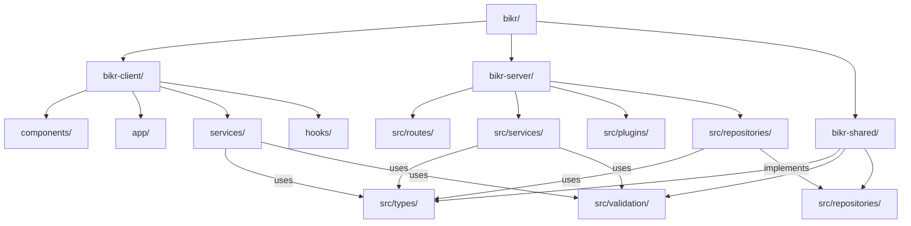
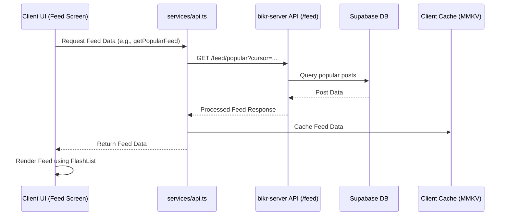
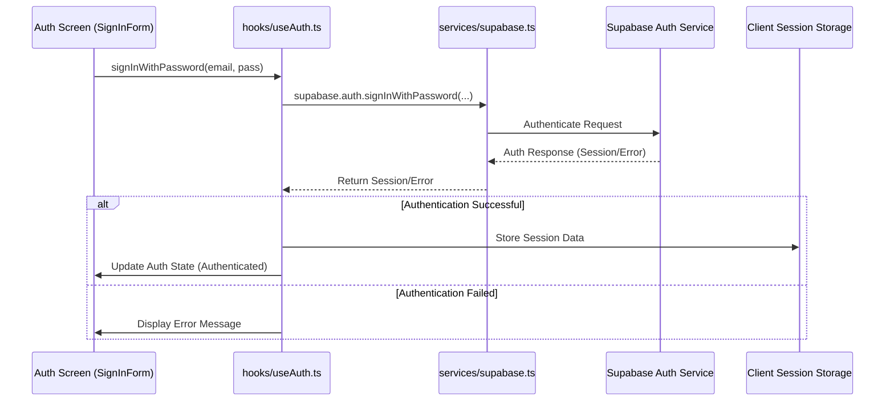

# System Architecture Patterns

## Navigation Structure
```mermaid
flowchart TD
    Root[_layout.tsx] --> Tabs[(tabs)/_layout]
    Tabs --> Explore[explore.tsx]
    Tabs --> Index[index.tsx]
    Root --> NotFound[+not-found.tsx]
```

## Key Implementation Patterns
1. **File-based Routing**: Expo Router convention
2. **UI Components**:
   - ThemedView/ThemedText for style consistency
   - ParallaxScrollView for featured content
   - HapticTab for tactile feedback
3. **State Management**:
   - MMKV for persistent storage
   - React Hook Form + Zod for validated forms
4. **Realtime Updates**:
   - Supabase Realtime websockets
   - Shopify FlashList for performant rendering
5. **Theming System**:
   - useColorScheme hook
   - Tamagui design tokens
   - Constants/Colors.ts definitions

## Project Structure


## Client-Server Interaction Architecture
```mermaid
graph TD
    Client[bikr-client] --> |HTTP Requests via api.ts| ServerAPI[bikr-server API]
    Client --> |Direct Auth/Realtime/Storage| Supabase[Supabase]
    ServerAPI --> |Database Operations| Supabase
    
    subgraph "bikr-client"
        ClientServices[services/api.ts]
        ClientSupabase[services/supabase.ts]
        ClientHooks[hooks/useAuth.ts]
        ClientComponents[components/]
        ClientApp[app/]
    end
    
    subgraph "bikr-server API"
        ServerRoutes[src/routes/]
        ServerServices[src/services/]
        ServerValidation[Validation (uses bikr-shared)]
    end
    
    subgraph "Supabase"
        SubAuth[Authentication]
        SubDB[Database]
        SubRealtime[Realtime]
        SubStorage[Storage]
    end
    
    ClientServices --> ServerRoutes
    ClientSupabase --> SubAuth
    ClientSupabase --> SubRealtime
    ClientSupabase --> SubStorage
    ClientHooks --> ClientSupabase
    ServerServices --> SubDB
```

## Client Data Flow Example (Feed)


## Client Authentication Flow

