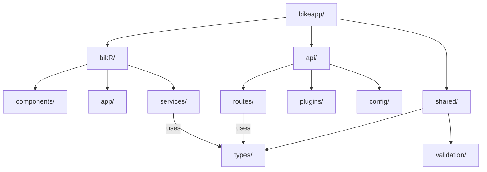
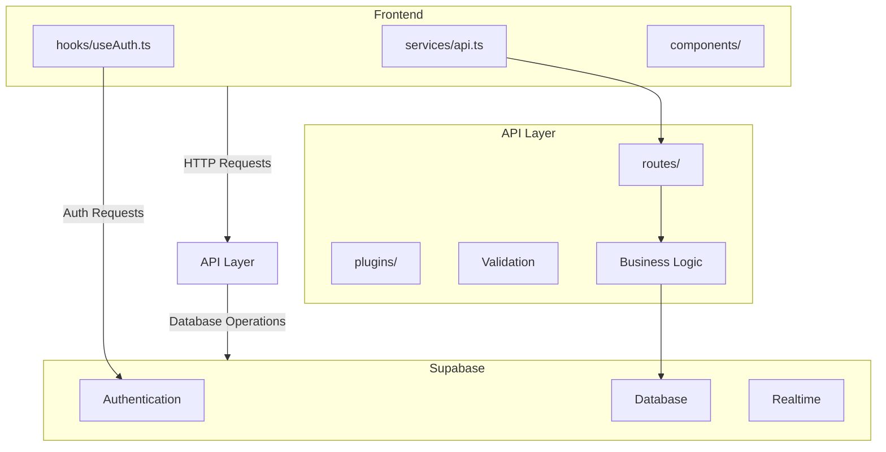

# System Architecture Patterns

## Navigation Structure
```mermaid
flowchart TD
    Root[_layout.tsx] --> Tabs[(tabs)/_layout]
    Tabs --> Explore[explore.tsx]
    Tabs --> Index[index.tsx]
    Root --> NotFound[+not-found.tsx]
```

## Key Implementation Patterns
1. **File-based Routing**: Expo Router convention
2. **UI Components**:
   - ThemedView/ThemedText for style consistency
   - ParallaxScrollView for featured content
   - HapticTab for tactile feedback
3. **State Management**:
   - MMKV for persistent storage
   - React Hook Form + Zod for validated forms
4. **Realtime Updates**:
   - Supabase Realtime websockets
   - Shopify FlashList for performant rendering
5. **Theming System**:
   - useColorScheme hook
   - Tamagui design tokens
   - Constants/Colors.ts definitions

## Monorepo Structure


## API Layer Architecture


## API Integration Flow
```mermaid
sequenceDiagram
    App->>API: API Request
    API->>Supabase: Database Operation
    Supabase-->>API: Response Data
    API-->>App: Processed Response
    
    App->>Supabase: Direct Auth Request
    Supabase-->>App: JWT Token
    
    App->>Supabase: Realtime Subscribe
    Supabase->>App: Realtime Updates
    
    App->>MMKV: Cache Data
