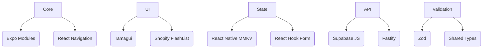

# Technical Context

## Core Technologies
- **Expo SDK**: 52.0.43
- **React Native**: 0.76.9
- **TypeScript**: 5.3.3
- **Supabase JS**: 2.49.4 (+ Auth 2.69, Realtime 2.11)
- **React Navigation**: 7.x (Native Stack + Bottom Tabs)
- **Tamagui**: 1.125.33 UI system
- **Fastify**: 4.26.0 (API server)
- **Zod**: 3.24.2 (Validation)

## Critical Dependencies


## Project Structure
```
bikeapp/                   # Monorepo Root
├── package.json           # Workspace configuration
├── bikR/                  # Mobile App (Expo/React Native)
├── api/                   # API Layer (Fastify)
└── shared/                # Shared Code (Types + Validation)
```

## Windows Development Environment
### Required Setup
1. Android Studio 2022.3+ with:
   - Android SDK 33
   - Intel HAXM (for emulator acceleration)
   - Google Play Services
2. System Environment Variables:
   ```bash
   ANDROID_HOME=C:\Users\marek\AppData\Local\Android\Sdk
   JAVA_HOME=C:\Program Files\Java\jdk-17
   ```
3. PowerShell Execution Policy:
   ```powershell
   Set-ExecutionPolicy RemoteSigned -Scope CurrentUser
   ```

### Expo CLI Commands
```bash
# Start dev server
expo start --windows

# Android build
npm run android -- --variant=debug

# Type checking
npx tsc --noEmit
```

## Key Integration Patterns
- **Supabase**: Configured via ENV vars in `.env`
- **TypeScript**: Strict mode enabled (tsconfig.json)
- **Testing**: Jest + React Test Renderer
- **Linting**: Expo default ESLint config
- **API Layer**: Fastify with type-safe endpoints via shared types
- **Monorepo**: npm workspaces for coordinated development
- **Supabase Storage (Post Media)**:
  - **Strategy**: Frontend uploads directly to Supabase Storage.
  - **Bucket Name**: `posts-media`
  - **Path Structure**: `{user_id}/{timestamp}_{filename}` (e.g., `uuid/1678886400000_image.jpg`)
  - **RLS Policies**:
    - Upload: Authenticated users insert into their own path (`auth.uid()`).
    - Read: Public read access.
    - Update/Delete: Restricted to file owner (`auth.uid()`).
  - **API Interaction**: API receives storage object paths (`mediaIds`) from frontend, generates public URLs using `getPublicUrl()`, and stores URLs in the `media` database table.
