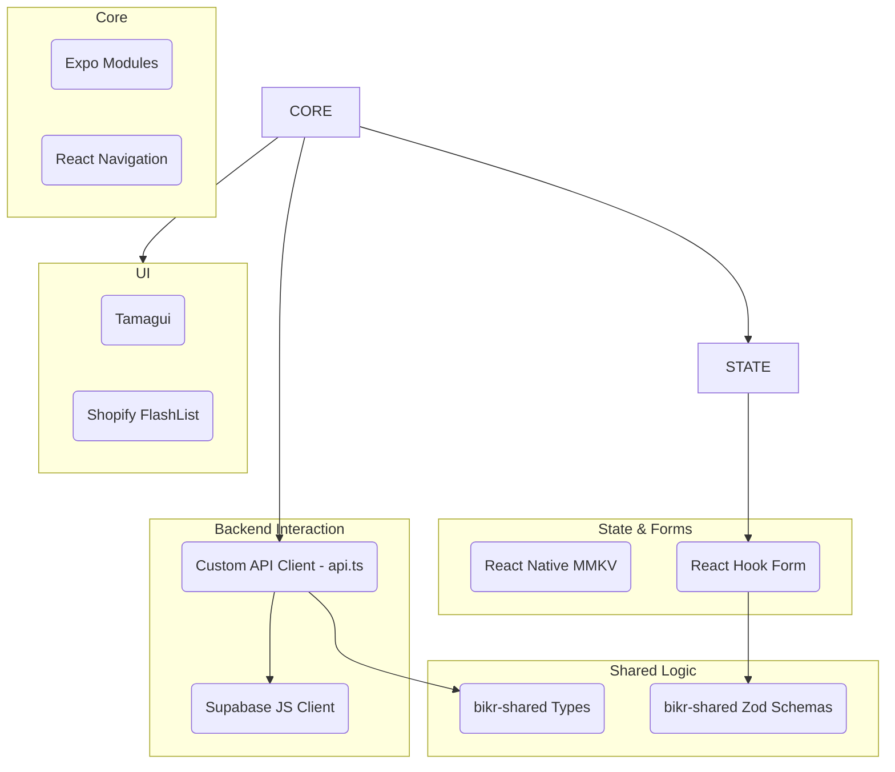

# Technical Context

## Core Technologies
- **Expo SDK**: 52.0.43
- **React Native**: 0.76.9
- **TypeScript**: 5.3.3
- **Supabase JS**: 2.49.4 (+ Auth 2.69, Realtime 2.11)
- **React Navigation**: 7.x (Native Stack + Bottom Tabs)
- **Tamagui**: 1.125.33 UI system
- **Zod**: 3.24.2 (Validation - via `bikr-shared`)
- **Expo Image Picker**: ^15.0.7 (Media selection)
- **Expo Location**: ^17.0.1 (Local feed functionality)

## Critical Dependencies (Client)


## Project Structure (Relevant to Client)
```
bikr/                      # Project Root
├── bikr-client/           # Mobile App (This Project)
│   ├── app/               # Expo Router screens
│   ├── assets/
│   ├── components/        # Reusable UI components
│   ├── constants/
│   ├── contexts/          # App-wide contexts (e.g., FeedContext)
│   ├── hooks/             # Custom hooks (e.g., useAuth)
│   ├── memory-bank/       # Documentation specific to client
│   ├── repositories/      # Data access layer (e.g., SupabaseContentRepository)
│   ├── services/          # API client (api.ts, supabase.ts)
│   ├── utils/             # Utility functions (e.g., feedCache)
│   ├── app.json
│   ├── package.json
│   └── tsconfig.json
├── bikr-server/           # API Layer (Separate Project)
└── bikr-shared/           # Shared Code (Types + Validation)
```

## Windows Development Environment (Client Focus)
### Required Setup
1. Android Studio 2022.3+ with:
   - Android SDK 33
   - Intel HAXM (for emulator acceleration)
   - Google Play Services
2. System Environment Variables:
   ```bash
   ANDROID_HOME=C:\Users\marek\AppData\Local\Android\Sdk
   JAVA_HOME=C:\Program Files\Java\jdk-17
   ```
3. PowerShell Execution Policy:
   ```powershell
   Set-ExecutionPolicy RemoteSigned -Scope CurrentUser
   ```

### Client CLI Commands (Run from `bikr-client/`)
```bash
# Install dependencies
npm install

# Start dev server
npx expo start --clear

# Run on Android
npm run android

# Run on iOS (macOS only)
npm run ios

# Run on Web
npm run web

# Type checking
npm run typecheck

# Linting
npm run lint

# Testing
npm test
```

## Key Integration Patterns (Client)
- **Supabase Client**: Configured via ENV vars in `bikr-client/.env` (`services/supabase.ts`). Used for Auth, Realtime, Storage uploads.
- **API Client**: Custom client (`services/api.ts`) interacts with `bikr-server` endpoints using Fetch API.
- **TypeScript**: Strict mode enabled (`bikr-client/tsconfig.json`). Uses types from `bikr-shared`.
- **Testing**: Jest + React Test Renderer for component testing.
- **Linting**: Expo default ESLint config.
- **Shared Code**: Utilizes types and validation schemas from the `bikr-shared` package.
- **Repository Pattern**: Used for abstracting data access (e.g., `SupabaseProfileRepository`, `SupabaseContentRepository`, `SupabaseFeedRepository`). Repositories interact with `services/supabase.ts` or `services/api.ts`.
- **Feed Context**: `FeedContext` (`contexts/FeedContext.tsx`) manages feed state and uses `SupabaseFeedRepository` for data fetching.
- **Content Creation**: `app/(tabs)/create.tsx` handles UI, uses `expo-image-picker` for media, and interacts with `SupabaseContentRepository`.
- **Supabase Storage (Post Media - Client Role)**:
  - **Strategy**: Client uploads directly to Supabase Storage via `SupabaseContentRepository`.
  - **Bucket Name**: `media` (as used in `SupabaseContentRepository`).
  - **Path Structure**: Repository generates path like `posts/{postId?}/{timestamp}-{filename}`.
  - **RLS Policies**: Client relies on Supabase RLS policies configured for the bucket (Upload requires auth, Read is public).
  - **API Interaction**: Client sends the generated storage object path(s) to the `bikr-server` API (e.g., during post creation/update). Client receives public URLs (generated by the server) for displaying media.
